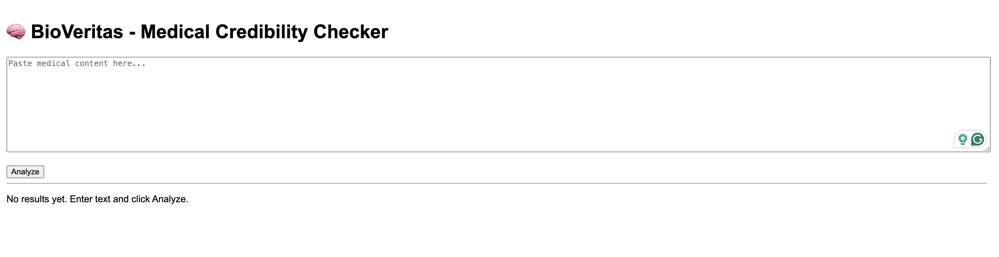
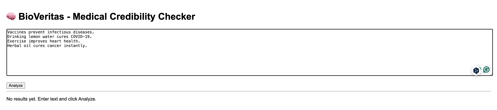
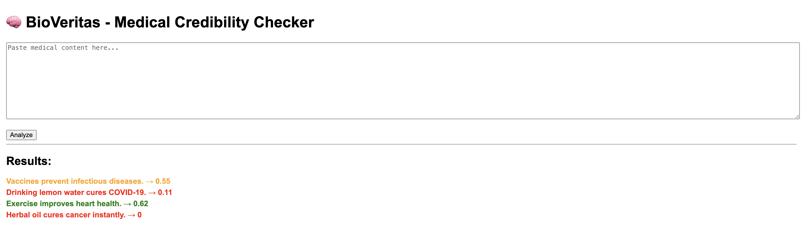

# BioVeritas - Medical Credibility Checker

BioVeritas is an AI-powered system that evaluates the credibility of medical content using Natural Language Processing and Machine Learning.

---

## Features

- Sentence-level credibility analysis  
- TF-IDF + Logistic Regression  
- Hybrid ML + rule-based verification  
- Color-coded output:
  - Green → Likely true  
  - Orange → Uncertain  
  - Red → Likely false  

---

## How it Works

1. Input medical text  
2. Split into sentences  
3. NLP preprocessing  
4. TF-IDF vectorization  
5. Logistic Regression prediction  
6. Rule-based score adjustment  
7. Display results  

---

## Project Structure

BioVeritas/
├── app.py
├── model.py
├── train.py
├── preprocessing.py
├── verifier.py
├── requirements.txt
│
├── dataset/
│   └── data.csv
│
├── templates/
│   └── index.html
│
├── screenshots/
│   ├── UI.png
│   ├── Content.png
│   └── Result.png

---

## Tech Stack

- Python  
- Flask  
- Scikit-learn  
- NLTK  

---

## How to Run

pip3 install -r requirements.txt  
python3 train.py  
python3 app.py  

Open in browser:  
http://127.0.0.1:5000  

---

## Sample Input

Vaccines prevent infectious diseases.  
Drinking lemon water cures COVID-19.  
Exercise improves heart health.  
Herbal oil cures cancer instantly.  

---

## Demo

### User Interface

### Input Example

### Output Result

---

## Note

This project uses a small dataset for demonstration purposes.

---

## Future Improvements

- Larger dataset  
- API integration  
- Transformer models  
- Improved UI  

---

## Author

Samhit Reddy
